<body> 
    <h1>🍕 Restaurant Ordering Web Application  </h1>  
    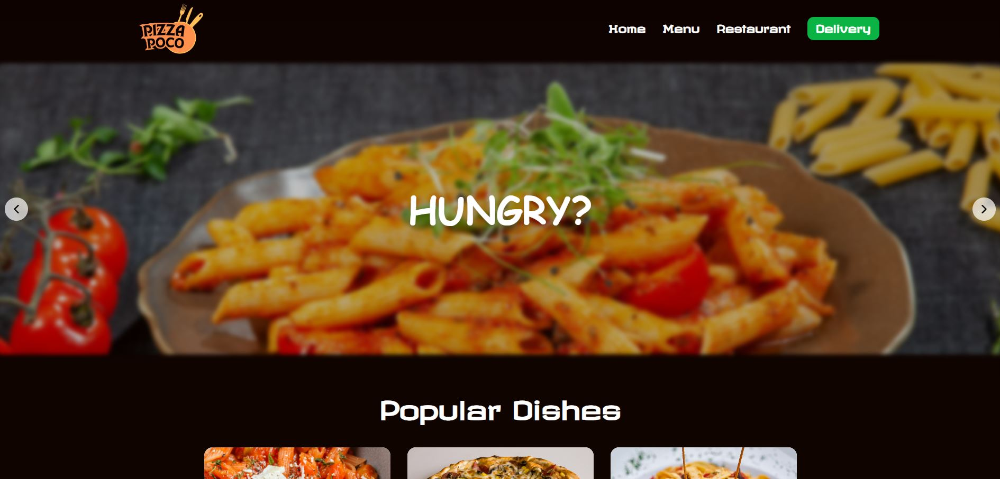 
    
'Pizza Poco' is a modern restaurant web application built to give users an engaging way to discover the restaurant’s location. It allows visitors to view the full menu, explore the most popular items, and easily find the restaurant’s physical address.
        In addition to browsing, users can place delivery orders by adding food and drinks to a cart and completing a checkout form. Once submitted, the order appears on the restaurant’s admin interface for processing.
        The entire web app aims to be as visually appealing and user-friendly as possible, with engaging design elements and smooth visual effects.

    <h2>Features</h2>
    <ul>
        <li>Popular dishes showcase</li>
        <li>Physical restaurant menu display</li>
        <li>Google Maps integration with opening hours and contact details</li>
        <li>Order placement functionality</li>
        <li>Food category filter</li>
        <li>Shopping cart system</li>
        <li>Interactive popup messages</li>
        <li>Administrator panel, dashboard</li>
        <li>Create, edit, and delete products in the database</li>
        <li>List and manage incoming orders</li>
        <li>Fully responsive design across all devices</li>
      </ul>        
    <h2>Tech Stack</h2>  
    
Front-End: ReactJS, Tailwind CSS, JavaScript
   
    
Back-End: NodeJS, Express

    
Database: MongoDB
   
    <h2>Popular Dishes</h2> 
    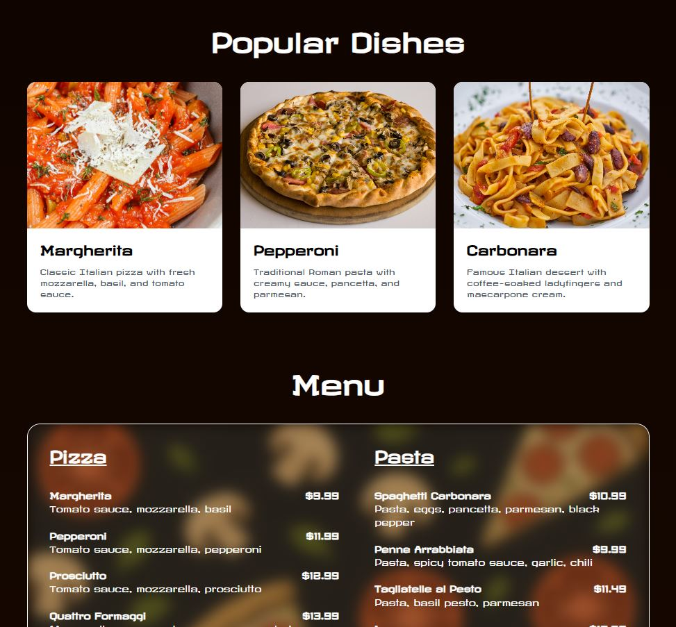    
    
After the hero section, where users can browse through images with overlayed texts, the most popular dishes are presented in small, eye-catching cards designed to spark users' interest – or even their appetite.    Below that, the restaurant’s full menu is displayed, allowing users to browse the available items even before arriving at the location – perfect for checking it out on the way.

    <h2>Restaurant Info & Footer</h2>  
    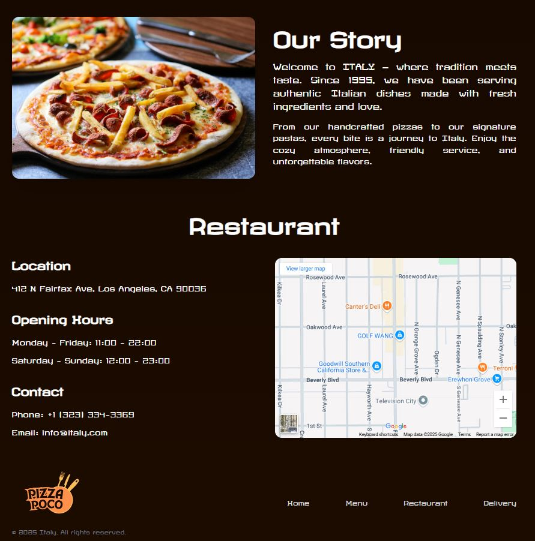    
    
The next section is the 'Story', featuring a short background about the restaurant. This is followed by the restaurant’s opening hours and contact information, along with an integrated Google Map showing the exact location. At the bottom of every page, a minimalist footer provides quick and simple navigation.

    <h2>Food Delivery</h2>
    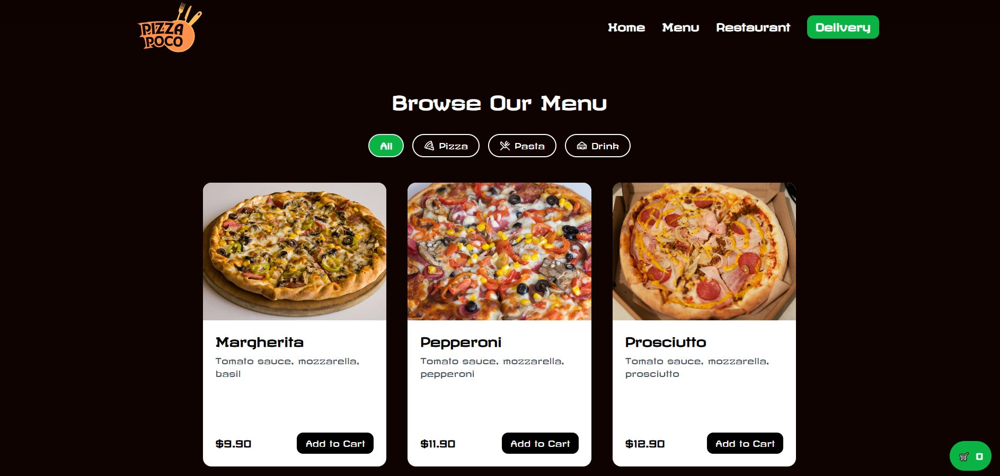
    
In this section, users can place delivery orders from the restaurant’s offerings. A category filter is available for faster browsing, and the food and drink items are displayed in compact cards. On larger screens, the cards are shown in multiple dynamic columns, while on smaller screens, they appear in one or two vertical columns – all rendered dynamically from the MongoDB database.

    <h2>Cart</h2>
    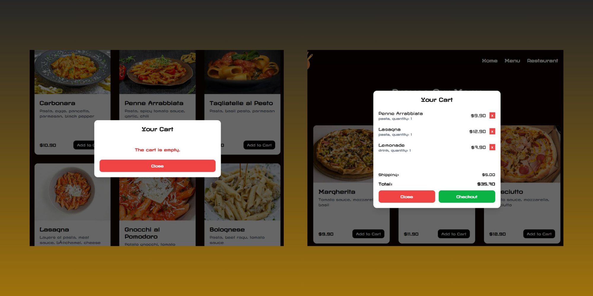  
    
Items added to the cart appear in a vertically and horizontally centered cart interface, clearly displaying and summarizing the contents for the user. If the cart is empty, the user is informed accordingly. Users can also remove individual items from the cart if needed.

    <h2>Checkout</h2>
    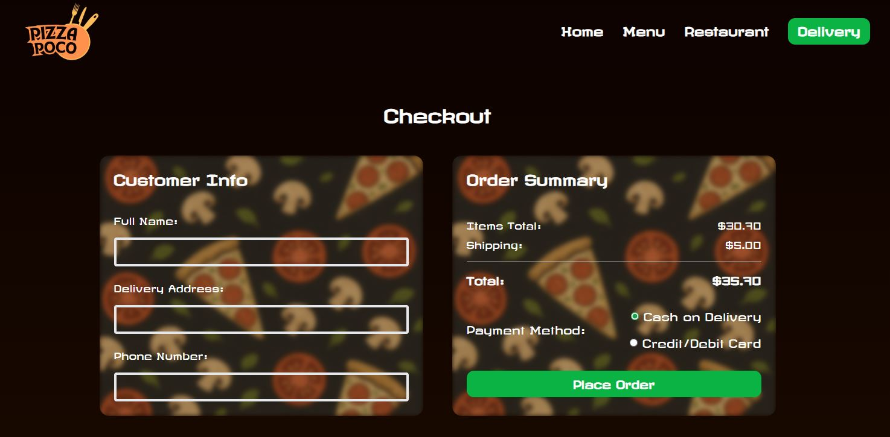 
    
After proceeding from the cart, users are presented with a checkout form where they must enter their personal details, including name, delivery address, and phone number. They can also choose between cash or card as their preferred payment method.

    <h2>Placed Order</h2>
    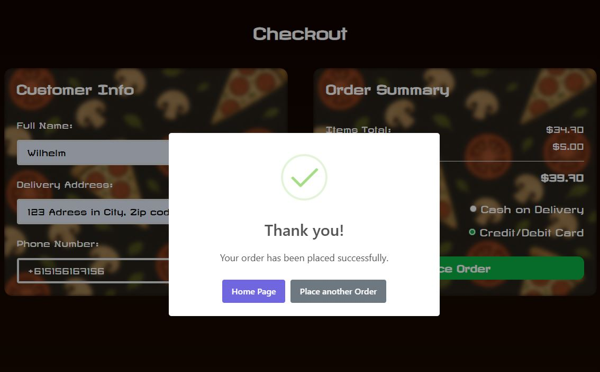
    
Once the required details are submitted, the order is successfully stored in the MongoDB orders collection. A SweetAlert popup then notifies the user whether the order was placed successfully or if an error occurred.

    <h2>Admin Panel</h2>
    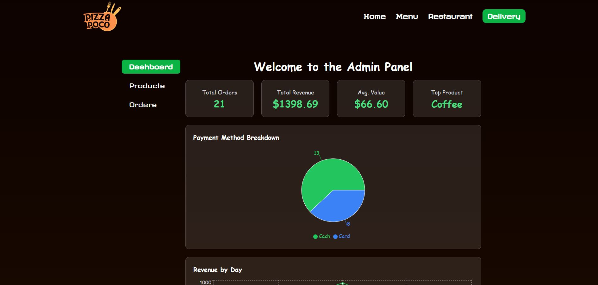
    
Naturally, the restaurant has access to an admin panel where essential operations can be monitored and managed. This includes tracking orders and viewing statistics, as well as creating, editing, and deleting products.

    <h2>Dashboard</h2>
    
    
The admin dashboard provides access to key and insightful statistics, such as the total number of orders, overall revenue, average cart value, and the most popular food and drink items.           In addition, a pie chart displays the ratio between card and cash payments, while a revenue-over-time chart shows daily income trends—helping identify which days are the most profitable and offering a clear overview of weekly popularity patterns.

    <h2>Products</h2>
    
    
In the Products section, all records stored in the database are dynamically listed in a card-based layout similar to the Delivery section. A category filter is also available here, allowing users to browse items by type – such as pizzas, pastas, and drinks.

    <h2>Add, Edit & Delete</h2>
    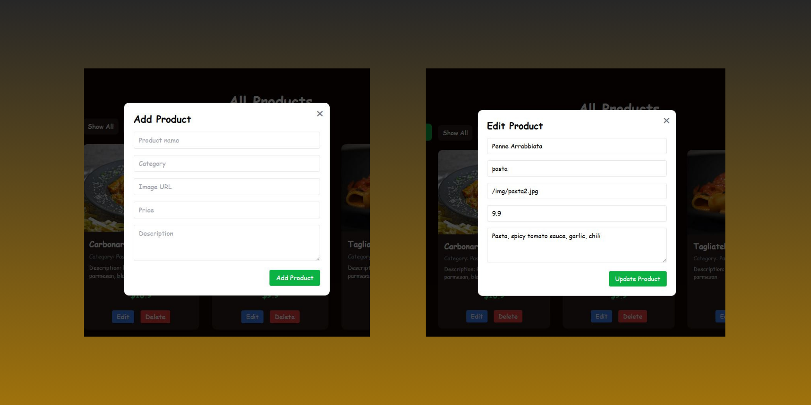
    
In the Admin Panel, records can be added, edited, or deleted directly from the table. By clicking the corresponding buttons, dedicated interfaces appear for each action. When adding or editing a record, a small form is displayed—centered both vertically and horizontally—allowing the admin to input or update the necessary data.

    <h2>Popup Messages</h2>
    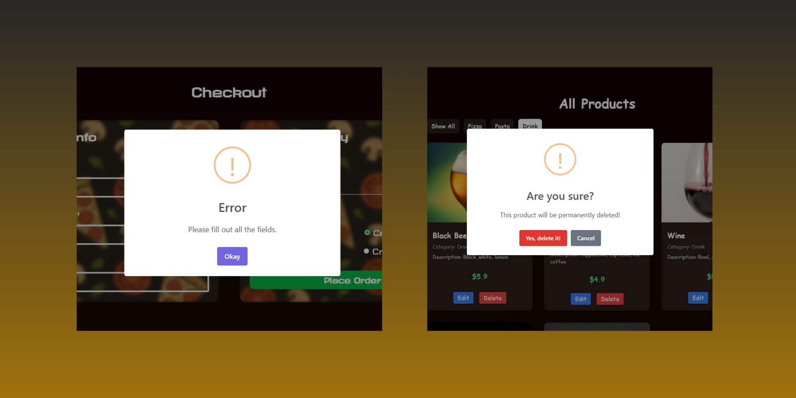
    
If the user submits incomplete or invalid data, a SweetAlert popup appears to alert them and prompt correction. When attempting to delete an existing product from the list, an interactive confirmation dialog is also shown to ensure the action is intentional.

    <h2>Orders</h2>
    
    
The final feature is the Received Orders, where all customer orders are displayed for the restaurant to prepare and deliver. Alongside the ordered food and drinks, the interface also shows the customer's details, the total amount to be paid, and the elapsed time since the order was placed.

    <h2>Responsive Design</h2>
    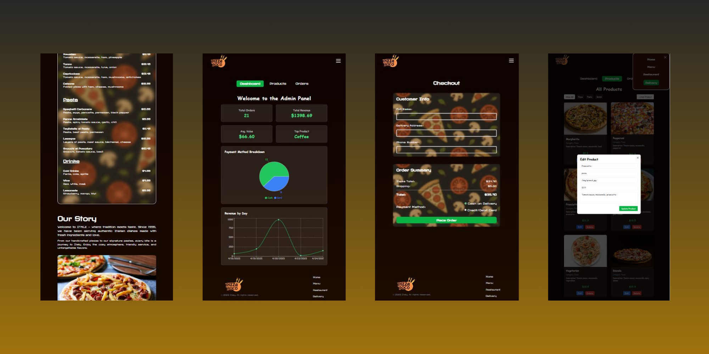
    
To conclude, all pages and features have been built with full responsiveness in mind, ensuring accessibility across all smart devices. Most components are arranged in a vertical layout for optimal mobile viewing, and the navigation bar transforms into a collapsible menu accessible from the top-right corner.

    
    
    